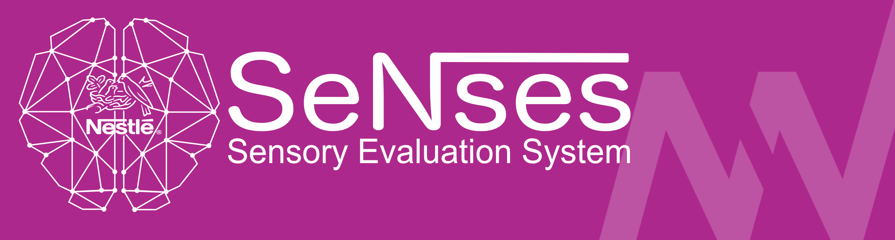
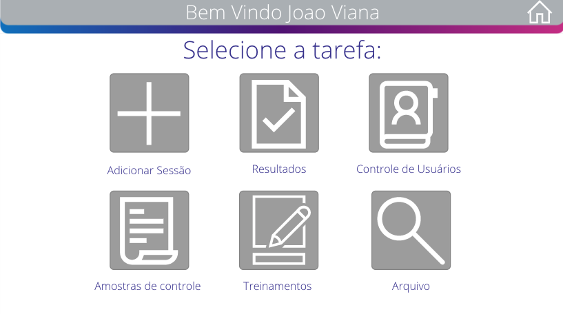
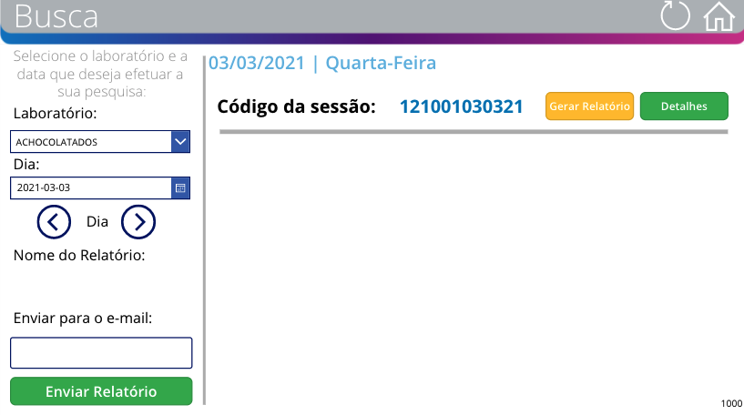
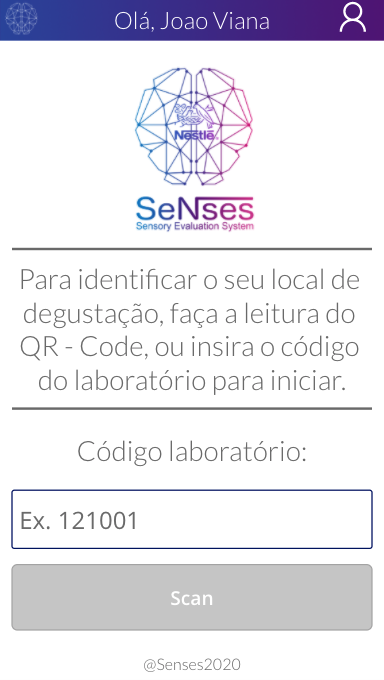
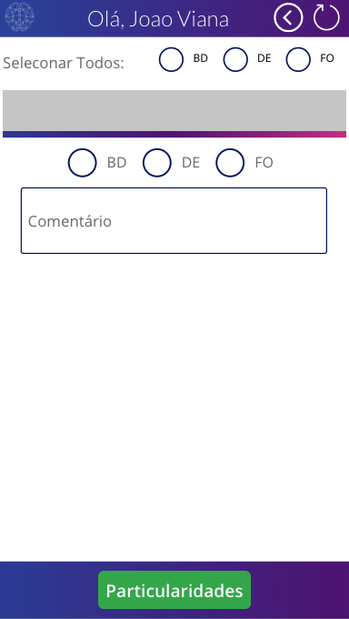

<h1 align="center">
    
</h1>

<h4 align="center"> 
	Status: Implementado! ✅
</h4>

 <a href="#-sobre-o-projeto">Sobre</a> •
 <a href="#-funcionalidades">Funcionalidades</a> •
 <a href="#-layout">Layout</a> • 
 <a href="#-como-executar-o-projeto">Como executar</a> • 
 <a href="#-tecnologias">Tecnologias</a> • 
 <a href="#-autor">Autor</a> 

## 💻 Sobre o projeto

SENSES -  é um projeto para gerenciar as sessões diárias de degustação de produtos em uma fábrica de achocolatados e café. 

Desenvolvido em Araras, conta com duas aplicações, uma mobile, usada pelos degustadores, inserindo os resultados da degustação via SmartPhone e outra aplicação para Desktop, para gerenciar essas sessões, entregando para o Analista de Degustação todas as notas inseridas pelos degustadores, a pontuação do produto degustado, e se este, está dentro dos padrões de qualidade.

---

## ⚙️ Funcionalidades
Aplicativo de gestão (Dektop):

- [x] Abrir Sessões:
  - [x] Adicionar produtos a serem degustados na sessão.
  - [x] inserir informações e especificações do produto.
  - [x] Adicionar ou não avaliação de embalagem.

- [x] Consultar resultados das sessões contendo:
  - [x] notas dos degustadores.
  - [x] cálculo da qualidade do produto.
  - [x] comentários dos degustadores.

- [x] Consultar arquivo de sessões anteriores contendo:
  - [x] notas dos degustadores.
  - [x] cálculo da qualidade do produto.
  - [x] comentários dos degustadores.

Aplicativo do degustador (Mobile):

- [x] Avaliar produtos presentes a sessão, inserindo:
  - [x] notas para o produto.
  - [x] comentários para o produto.
  - [x] notas para as embalagens .

---

## 🎨 Layout

### Desktop - Gestão 

  

  

### Mobile - Degustadores

  

  

---

## 🚀 Como executar o projeto

Este projeto é desenvolvido via PowerApps, logo para executá-lo é necessário participar da organizacão e solicitar acesso para o desenvolvedor -> joaobonilha96@gmail.com

Lembrando que esse repositório tem como obetivo apenas demonstrar os projetos desenvolvidos para contrução do meu portifólio profissional, e não compartilhar as aplicações.

---

## 🛠 Tecnologias

As seguintes ferramentas foram usadas na construção do projeto:

#### **Aplicativos**  
-   **[Power Apps](https://powerapps.microsoft.com/pt-br/)**
-   **[Power Automate](https://flow.microsoft.com/pt-br/)**
-   **[SQL Server](https://www.microsoft.com/pt-br/sql-server/sql-server-downloads)**
-   **[Azure Database](https://azure.microsoft.com/pt-br/)**

---

## 🦸 Autor

<a>
 
  
 <b> João Bonilha Viana</b></a>
  

---

Feito com ❤️ por João Bonilha Viana 👨🏼‍💻 [Entre em contato!](https://www.linkedin.com/in/VianaJo1/)

---
